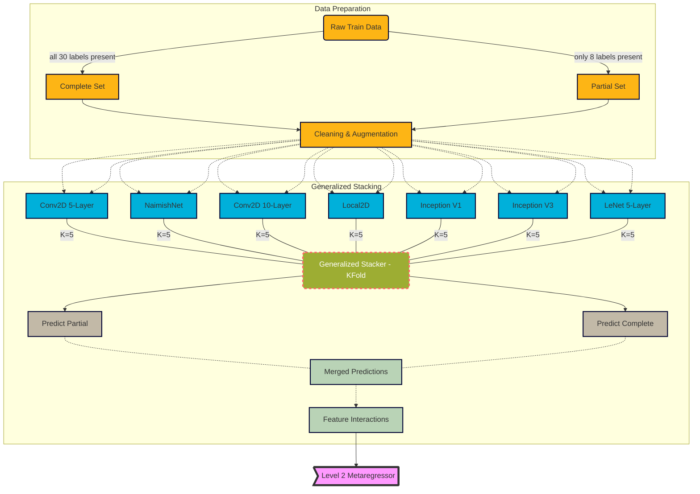
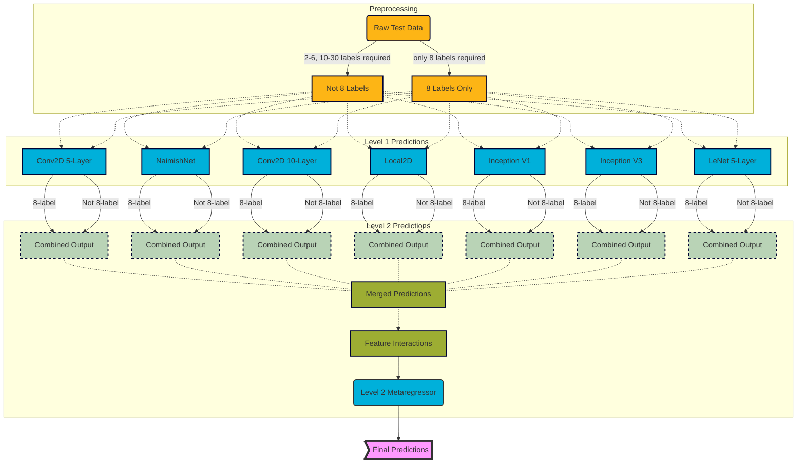

Facial Keypoints Detection
===========================
**Authors** : [Cristopher Benge](https://cbenge509.github.io/) | [William Casey King]([https://jackson.yale.edu/person/casey-king/](https://jackson.yale.edu/person/casey-king/)) 
U.C. Berkeley, Masters in Information & Data Science program - [datascience@berkeley]([https://datascience.berkeley.edu/](https://datascience.berkeley.edu/)) 
Spring 2020, W207 - Machine Learning - D. Schioberg, PhD
Section 5 - Wed. 4:00pm PDT

## Description

This repo contains a solution for the [Kaggle Facial Keypoints Detection]([https://www.kaggle.com/c/facial-keypoints-detection](https://www.kaggle.com/c/facial-keypoints-detection)) challenge, achieving a best score of **~1.42 RMSE**, which is good for a 4th place position on the [now locked] private leaderboard:

## Evaluation Criteria

The Kaggle facial keypoints detection challenge asks competitors to identify, with as small an error as possible, the (x,y) point coordinates for up to 15 facial landmarks (left center eye, nose tip, left outer eyebrow, etc) on 1,783 images in the provided TEST dataset.  All images are sized as 96x96x1 grayscale.  Each point is submitted as their individual X and Y coordinate values for separate scoring, thus competitors will need to submit up to 30 values for an image containing all 15 landmarks.

The competition is ranked by the lowest error in prediction by the [Root Mean Squared Error](https://en.wikipedia.org/wiki/Root-mean-square_deviation):
$$
\sqrt{\left(\frac{1}{n}\right)\sum_{i=1}^{n}(y_{i} - x_{i})^{2}}
$$

## Training Pipeline

## Inference Pipeline
